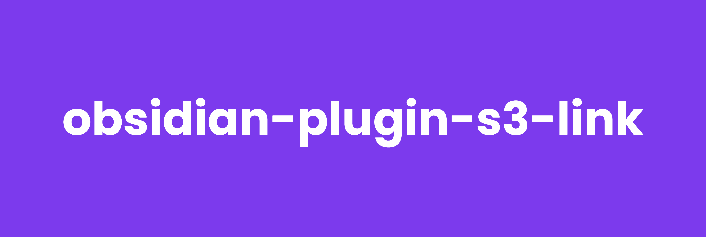

# 🪨 obsidian-plugin-s3-link



> A plugin that can retrieve and cache images from AWS S3 Buckets


## How to Use

The plugin supports custom urls to a AWS S3 Bucket

`s3:[objectKey]`

This will download the file that is found with the specific objectKey and cache it locally. Subsequent urls that point to the same urls will use the file from the cache. The `obsidian-plugin-s3-link` will regularly check if a newer version is available in the bucket but only download the file if it is necessary.

`s3-sign[objectKey]`

With the `s3-sign` scheme the plugin will create a signed url instead of downloading the file itself. The signed url that is created is valid for 7 days and the plugin will create a new one automatically once it is expired.

> **_Note:_** Signed urls can not be used with the embed functionality. Embedded links expect a local file. The following documentation shows which links support signed urls.

### Image Links

The classic markdown way of embedding images.

Markdown image link

```

```

Markdown signed url link
```

```

### Anchor Links

Markdown Link

```
[Name of the link](s3:[objectKey])
```

> This will create a clickable link that opens the file within obsidian

```
[Name of the link](s3-sign:[objectKey])
```

This will create a link that opens the file within the browser

### Video Links

HTML video link

```
<video src="s3:[objectKey]" controls=""></video>
```

HTML video sign link

```
<video src="s3-sign:[objectKey]" controls=""></video>
```

Obsidian Video Embed

```
![[s3:[objectKey]]]
```

> **_Note:_** Signed urls are not supported

### PDF Links

```
![[s3:[objectKey]]]
```

> **_Note:_** Signed urls are not supported

### Sound Links

```
![[s3:[objectKey]]]
```

> **_Note:_** Signed urls are not supported


### Configuration

The plugin needs some basic configuration before it work.

##### S3 Bucket Name

The AWS S3 Bucket name

##### S3 Bucket Region

The Region the AWS S3 Bucket resides in

##### AWS Credentials

The plugin supports authentication via credentials file in `~/.aws/credentials` or via Access Key Id and Secret Access Key.

> **_Note:_** It is recommended to use the profile to prevent credentials being stored withing obsidian

###### AWS Profile

The plugin will look for all profiles in `~/.aws/credentials` and make them available in the settings.

###### AWS Access Key ID

The Access Key ID of your AWS IAM user

###### AWS Secret Access Key

The Secret Access Key of your AWS IAM user

##### S3 Bucket CORS configuration

The AWS S3 Buckets needs to have CORS configured to allow requests from Obsidian.

```json
[
    {
        "AllowedHeaders": [
            "*"
        ],
        "AllowedMethods": [
            "GET",
            "HEAD"
        ],
        "AllowedOrigins": [
            "*"
        ],
        "ExposeHeaders": [],
        "MaxAgeSeconds": 3000
    }
]
```

##### AWS IAM User

Example IAM configuration for user read access to an S3 Bucket

```json
{
    "Statement": [
        {
            "Action": [
                "s3:ListBucketVersions",
                "s3:ListBucket",
                "s3:GetBucketLocation"
            ],
            "Effect": "Allow",
            "Resource": "arn:aws:s3:::[bucketname]",
            "Sid": ""
        },
        {
            "Action": [
                "s3:GetObjectVersion",
                "s3:GetObject"
            ],
            "Effect": "Allow",
            "Resource": "arn:aws:s3:::[bucketname]/*",
            "Sid": ""
        }
    ],
    "Version": "2012-10-17"
}
```

### Commands

## Development


##### Dependencies 

```
npm install
```

##### Run Project

This will watch the project for changes. Once the build is finished Obsidian can be reloaded with `Reload app without saving` command (usually activated with `CTRL` + `P`).

```
npm run dev
```

##### Run ESLint

```
npx eslint .
```

## License

MIT License

Copyright (c) 2023 Michael Wiesendanger

Permission is hereby granted, free of charge, to any person obtaining
a copy of this software and associated documentation files (the
"Software"), to deal in the Software without restriction, including
without limitation the rights to use, copy, modify, merge, publish,
distribute, sublicense, and/or sell copies of the Software, and to
permit persons to whom the Software is furnished to do so, subject to
the following conditions:

The above copyright notice and this permission notice shall be
included in all copies or substantial portions of the Software.

THE SOFTWARE IS PROVIDED "AS IS", WITHOUT WARRANTY OF ANY KIND,
EXPRESS OR IMPLIED, INCLUDING BUT NOT LIMITED TO THE WARRANTIES OF
MERCHANTABILITY, FITNESS FOR A PARTICULAR PURPOSE AND
NONINFRINGEMENT. IN NO EVENT SHALL THE AUTHORS OR COPYRIGHT HOLDERS BE
LIABLE FOR ANY CLAIM, DAMAGES OR OTHER LIABILITY, WHETHER IN AN ACTION
OF CONTRACT, TORT OR OTHERWISE, ARISING FROM, OUT OF OR IN CONNECTION
WITH THE SOFTWARE OR THE USE OR OTHER DEALINGS IN THE SOFTWARE.