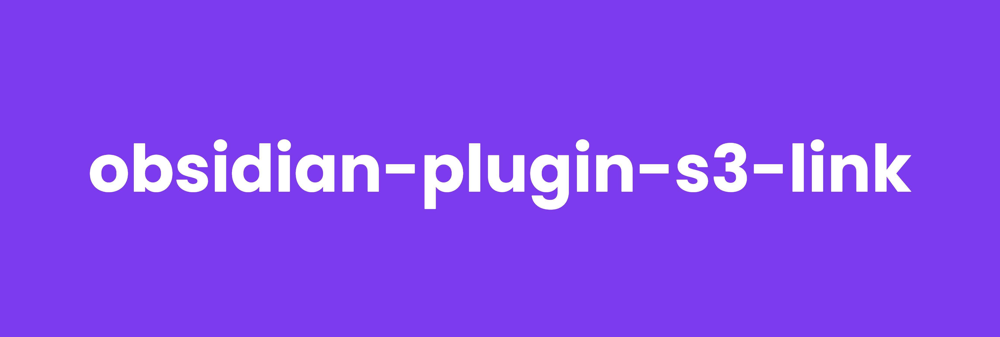

# 🪨 obsidian-plugin-s3-link



[](https://github.com/RagedUnicorn/obsidian-plugin-s3-link/actions/workflows/lint.yaml)
[](https://github.com/RagedUnicorn/obsidian-plugin-s3-link/actions/workflows/test.yaml)
[](https://github.com/RagedUnicorn/obsidian-plugin-s3-link/actions/workflows/typecheck.yaml)
[](LICENSE)

> A plugin that retrieves, references and caches objects from AWS S3 Buckets

## Overview

The plugin supports custom URLs to an AWS S3 Bucket, allowing users to retrieve, reference and cache files from S3 efficiently.

### Usage

To retrieve files:

-   **Standard URL:** `s3:[objectKey]`
    -   Downloads and caches the file locally. It checks periodically for newer versions in the S3 bucket but only downloads if a newer version exists.
-   **Signed URL:** `s3-sign[objectKey]`
    -   Creates a signed URL instead of downloading the file. The generated signed URL is valid for 7 days and will be automatically renewed after expiration.

> Note: Signed URLs cannot be used with embed functionality, as embedded links expect a local file. The documentation below specifies which links support signed URLs.

### Embedding Content

-   **Image Links:**

```markdown


```

-   **Video Links:**

```markdown
<video src="s3:[objectKey]" controls></video>
<video src="s3-sign:[objectKey]" controls></video>
```

> Note: Signed URLs are not supported for obsidian video embeds.

-   **PDF & Sound Links:**

```markdown
![[s3:[objectKey]]]
```

> Note: Signed URLs are not supported.

### Configuration

Before using the plugin, some basic configuration is needed:

-   **S3 Bucket Name:** Specify the AWS S3 Bucket name.
-   **S3 Bucket Region:** Define the region where the AWS S3 Bucket resides.
-   **AWS Credentials:** Authenticate using the `~/.aws/credentials` file or the Access Key Id and Secret Access Key.
    -   **AWS Profile:** The plugin checks all profiles in `~/.aws/credentials`.
    -   **AWS Access Key ID:** Your AWS IAM user's Access Key ID.
    -   **AWS Secret Access Key:** Your AWS IAM user's Secret Access Key.

> Note: Using the profile is recommended to avoid storing credentials directly within Obsidian.

-   **S3 Bucket CORS Configuration:** Ensure the S3 Bucket has CORS configured to accept requests from Obsidian.

```json
[
    {
        "AllowedHeaders": ["*"],
        "AllowedMethods": ["GET", "HEAD"],
        "AllowedOrigins": ["*"],
        "ExposeHeaders": [],
        "MaxAgeSeconds": 3000
    }
]
```

-   **AWS IAM User:** An example IAM configuration for user read access to an S3 Bucket.

```json
{
    "Statement": [
        {
            "Action": [
                "s3:ListBucketVersions",
                "s3:ListBucket",
                "s3:GetBucketLocation"
            ],
            "Effect": "Allow",
            "Resource": "arn:aws:s3:::[bucketname]",
            "Sid": ""
        },
        {
            "Action": ["s3:GetObjectVersion", "s3:GetObject"],
            "Effect": "Allow",
            "Resource": "arn:aws:s3:::[bucketname]/*",
            "Sid": ""
        }
    ],
    "Version": "2012-10-17"
}
```

## Development

See [DEVELOPMENT.md](DEVELOPMENT.md) for development setup, testing, and release instructions.

## License

MIT License

Copyright (c) 2025 Michael Wiesendanger

Permission is hereby granted, free of charge, to any person obtaining
a copy of this software and associated documentation files (the
"Software"), to deal in the Software without restriction, including
without limitation the rights to use, copy, modify, merge, publish,
distribute, sublicense, and/or sell copies of the Software, and to
permit persons to whom the Software is furnished to do so, subject to
the following conditions:

The above copyright notice and this permission notice shall be
included in all copies or substantial portions of the Software.

THE SOFTWARE IS PROVIDED "AS IS", WITHOUT WARRANTY OF ANY KIND,
EXPRESS OR IMPLIED, INCLUDING BUT NOT LIMITED TO THE WARRANTIES OF
MERCHANTABILITY, FITNESS FOR A PARTICULAR PURPOSE AND
NONINFRINGEMENT. IN NO EVENT SHALL THE AUTHORS OR COPYRIGHT HOLDERS BE
LIABLE FOR ANY CLAIM, DAMAGES OR OTHER LIABILITY, WHETHER IN AN ACTION
OF CONTRACT, TORT OR OTHERWISE, ARISING FROM, OUT OF OR IN CONNECTION
WITH THE SOFTWARE OR THE USE OR OTHER DEALINGS IN THE SOFTWARE.
