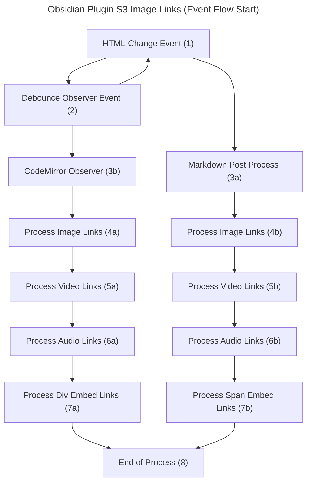

# Init Flow

> Overview of how document changes, openings, and parts brought into view are processed.

This flow describes the initiation and completion of the process.

## Flow Description

1. **HTML-Change Event (1):**  
   The process starts with an HTML event. Depending on the active view in Obsidian, it triggers either the MarkdownPostProcessor (3a) or the CodeMirror Observer (3b). See [Editor Modes Explained](#editor-modes-explained) for details.

2. **Debounce Observer (2):**  
   Debounces frequent events triggered by opening, scrolling, or editing documents to reduce processing load.

3. **MarkdownPostProcessor (3a):**  
   Processes the entire page when a document opens or external changes occur. This method avoids repeated processing during scrolling but may cause initial load delays.

4. **CodeMirror Observer (3b):**  
   Processes HTML elements for S3 links in preview mode. Unlike MarkdownPostProcessor, it handles small document chunks incrementally, necessitating duplicate-state management to prevent re-downloading.

5. **Process Steps (4a–7b):**

    - **4a/4b:** Search for and process S3 image links.
    - **5a/5b:** Search for and process S3 video links.
    - **6a/6b:** Search for and process S3 audio links.
    - **7a:** CodeMirror-specific: Handles `div` tags for embedding files.
    - **7b:** MarkdownPostProcessor-specific: Handles `span` tags for embedding files.

6. **End (8):**  
   The process completes once all content is processed.

## Editor Modes Explained

Obsidian operates in multiple editor modes:

### Editing vs. Reading Modes

-   **Editing:**  
    Includes both `Source Mode` and `Live Preview`.

    -   CodeMirror extension is invoked, but no elements are rendered, so no plugin processing occurs.

-   **Reading:**  
    In both modes, the MarkdownPostProcessor processes and resolves S3 links.

### Source Mode

-   Displays raw markdown for editing.
-   No S3 link processing in editing view.
-   Switching to reading view invokes the MarkdownPostProcessor to process content.

### Live Preview

-   Combines source and preview editing without switching views.
-   **Editing:**  
    CodeMirror extension handles content updates during scrolling or view changes.
-   **Reading:**  
    The MarkdownPostProcessor takes over to process content.
