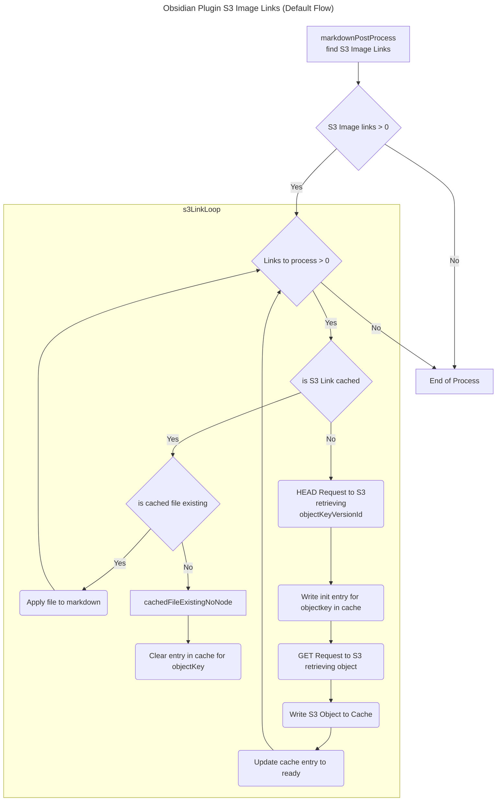

```mermaid
---

title: Obsidian Plugin S3 Image Links (Default Flow)

---

flowchart TD

  %% invoked by obsidian markdownPostProcess event

  startNode["markdownPostProcess\nfind S3 Image Links"] --> s3ImageLinkNode

  %% figure out if current leaf contains s3 image links

  s3ImageLinkNode{"S3 Image links > 0"}

  s3ImageLinkNode --> |"No"| endNode

  s3ImageLinkNode --> |"Yes"| linkProcessNode

 

  linkProcessNode{"Links to process > 0"}

  linkProcessNode --> |"No"| endNode

  linkProcessNode --> |"Yes"| isCachedNode

 

  subgraph s3LinkLoop

    %% check indexdb for cached objectKey
    %% TODO what if it is cached? at what point to we look if there is a new version available?
    isCachedNode{"is S3 Link cached"}

    isCachedNode --> |"Yes"| isCachedFileExistingNode

    isCachedNode --> |"No"| s3HeadRequestNode

 

    %% does the cached file exist on file

    isCachedFileExistingNode{"is cached file existing"}

    isCachedFileExistingNode --> |"Yes"| cachedFileExistingYesNode

    isCachedFileExistingNode --> |"No"| cachedFileExistingNoNode

    cachedFileExistingYesNode("Apply file to markdown")

    cachedFileExistingYesNode --> linkProcessNode

    cachedFileExistingNoNode --> clearCacheEntryNode

    clearCacheEntryNode("Clear entry in cache for objectKey")

 

    %% S3 HEAD request

    s3HeadRequestNode("HEAD Request to S3\n retrieving objectKeyVersionId")

    s3HeadRequestNode --> initCacheObjectKeyNode

 

    %% Write init entry to cached db

    initCacheObjectKeyNode("Write init entry for objectkey in cache")

    initCacheObjectKeyNode --> s3GetRequestNode

 

    %% S3 GET request

    s3GetRequestNode("GET Request to S3 retrieving object")

    s3GetRequestNode --> s3WriteObjectNode

    s3WriteObjectNode("Write S3 Object to Cache")

    s3WriteObjectNode --> updateCacheNode

    updateCacheNode("Update cache entry to ready")

    updateCacheNode --> linkProcessNode

  end

 

  %% end of process

  endNode["End of Process"]
```