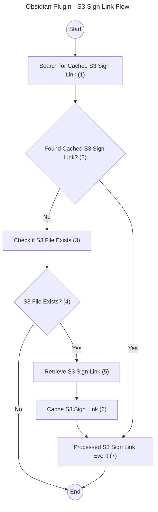

# Process Sign Link Flow

## Overview

This process handles generating and caching **S3 Signed Links** for accessing content stored in S3. It first checks for a cached link to avoid redundant operations, verifies file existence if necessary, generates a new signed link, and caches it for future use.

> **Note:**  
> The flows for **S3 Sign Links** and **S3 File Links** differ significantly. For details on the S3 File Links flow, refer to [process_file_link_flow.md](process_file_link_flow.md).

## Flow Description

1. **Search for Cached S3 Sign Link (1):**  
   The process checks if a signed link for the **object key** already exists in **local storage**. Signed links are valid for **7 days**.

    - Configuration: `config.ts` → `S3_SIGNED_LINK_EXPIRATION_TIME_SECONDS`

2. **Found Cached S3 Sign Link? (2):**

    - **Yes:** Forward the cached link and metadata as part of the **Processed S3 Sign Link Event** (Step 7).
    - **No:** Proceed to check if the file exists in the S3 bucket (Step 3).

3. **Check if S3 File Exists (3):**  
   Verify whether the specified object key exists in the S3 bucket. Files that do not exist are ignored, and the process ends.

4. **S3 File Exists? (4):**

    - **Yes:** Continue to retrieve a signed link.
    - **No:** Exit the process.

5. **Retrieve S3 Sign Link (5):**  
   Generate a **signed link** for the S3 object using the AWS S3 SDK.

6. **Cache S3 Sign Link (6):**  
   Cache the generated signed link and its metadata for future use.

7. **Processed S3 Sign Link Event (7):**  
   Emit an event containing the signed link and its metadata. This happens regardless of whether the link came from the cache or was newly generated.

## Key Notes

-   **Caching Strategy:** Links are cached to optimize performance and reduce unnecessary requests to S3.
-   **Expiration:** Signed links expire after a configurable duration (default: 7 days).
-   **Event Emission:** The process ensures an event is emitted with valid link data, simplifying downstream consumption.
