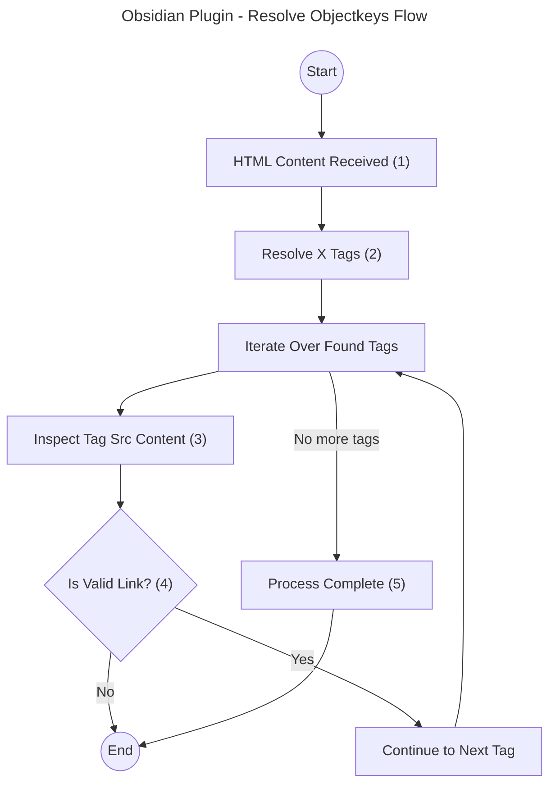

# Resolve X Flow

> Overview: This flow outlines the process of resolving object keys in specific HTML tags containing S3 links.

This process is all about parsing the received HTML-Event and figuring out the next steps. The work in this process is done by some form of a processor that is specialized for a certain HTML-Tag.

## Flow Description

1. **HTML Content Received (1):**  
   The process begins when a resolver receives raw HTML content. The content is distributed to all resolvers, each checking for specific target elements (e.g., ``, `<video>`).

2. **Resolve Targeted Tags (2):**  
   Each resolver identifies and extracts elements relevant to its scope, such as `` or `
`. Only targeted elements proceed to the next step.

3. **Inspect Src Content (3):**  
   The `src` attribute of each element is checked for S3-specific links (`S3-File` or `S3-Sign`). If an S3 link is found, the `objectKey` is extracted and stored. Elements sharing the same `objectKey` are grouped together.

4. **Is Valid Link:**  
   Check if src contains a valid link. If for example the link end with `/` it is not considered as valid bcause only S3 prefixes(folders) end with a slash. If a link is not considered as valid it is being ignored.

5. **Process Complete (5):**  
   The iteration continues until all elements have been processed. The final result is a `Map<objectKey, HTMLElement[]>` for both S3-File and S3-Sign links.

## Supported Elements

The plugin resolves the following HTML elements:

-   `` - Images
-   `<video>` - Videos
-   `<audio>` - Audio
-   `
` - Divs
-   `` - Spans

---

## Resolver Responsibilities

Each resolver handles the following tasks:

1. **Target Element Search**  
   Locates elements in the document relevant to its scope.

2. **Src Content Inspection**  
   Checks the `src` attribute for S3-File or S3-Sign links.

3. **Object Key Extraction**  
   Extracts the `objectKey` from valid links and groups HTML elements sharing the same key.

4. **Result Construction**  
   Returns a `Map<objectKey, HTMLElement[]>`, organizing elements based on the extracted `objectKey`.
